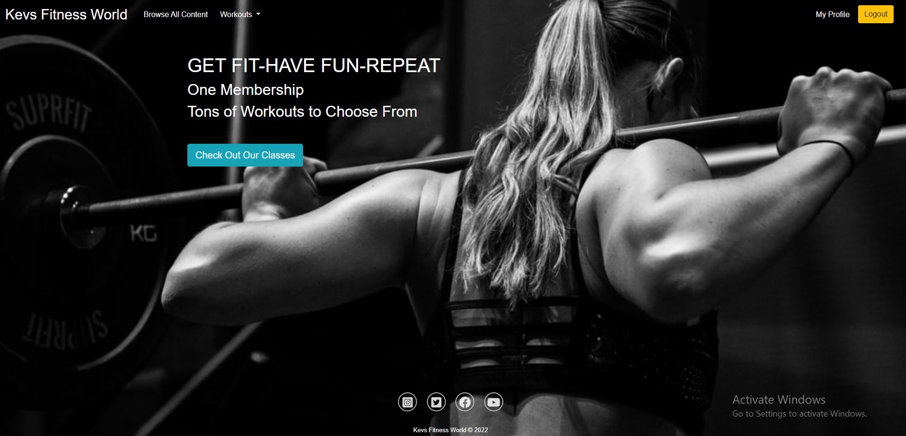
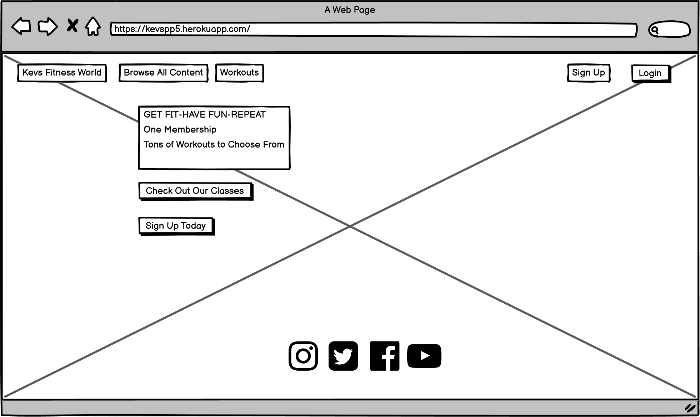
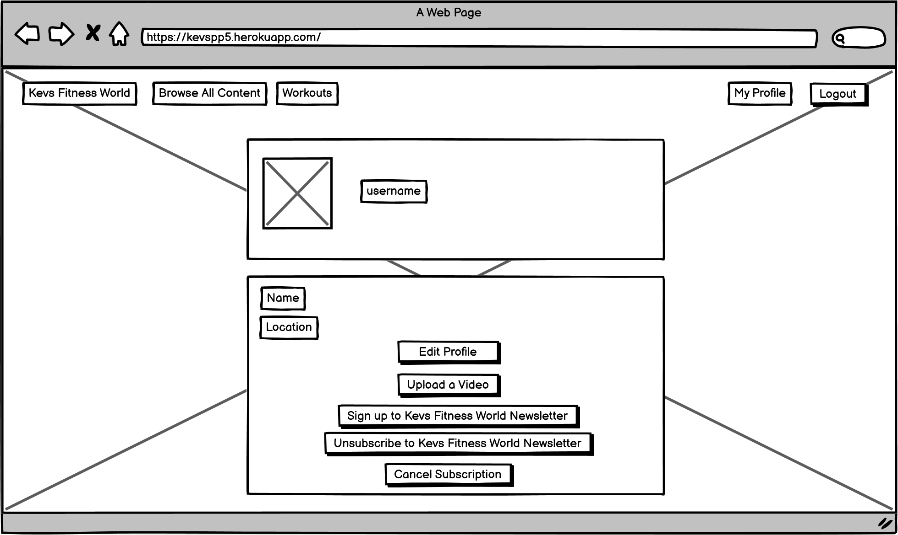

# Kevs Fitness World

## Description: Code Institute Student Project Portfolio 5: E-commerce Applications  

A fitness subscription application where a user sign up, view and comment on videocontent and upload there own videos. 
 
It showcases my ability to use the Python Django Framework, implementing CRUD Funtionality, Amazon Web Services and Stripe payments.

The deployed web application can be found [here](https://kevspp5.herokuapp.com/).

# Table of Contents
- [1. Introduction](#introduction)
- [2. How to use](#How-to-use)
- [3. Frameworks and Technologies](#Frameworks-and-Technologies)
- [4. Testing](#testing)
- [5. Bugs](#bugs)
- [6. Future Updates](#future-updates)
- [7. Contribution Links](#contribution-links)
- [8. Deployment](#deployment)
- [9. Wireframes](#wireframes)
- [9. E-commerce business model](#e-commerce-business-model)

# 1. Introduction
[Go to the top](#table-of-contents)

This is my final project portfolio required in the Full-Stack Software Development Diploma I am currently undertaking. It demonstrates the core skills and learnings I've taken from my experience throughtout the course. it's a subscription service using the Django Framework Django which is a Python-based free and open-source web framework, it follows the model–template–views architectural pattern and incoparates Stripe Payments.
 
The aim of the project to create a Fitness video sharing application.
The website will allow the user to register and make a recurring monthly payment via stripe payments and access the video content.
The user will be able to watch and comment on all video content.
The user will be able to upload and share there own video content.
The user will be able to cancel there subscription at any time.

## Purpose

### Workout Videos are Convenient For You as a Trainer 

Workout videos can help you reach your clients much more efficiently and give them the information they need. With one video conducting a workout, you will be able to share that with all of your clients and not need to instruct each individual client. 

### Workout Videos for Content Marketing

Trainers and coaches have the hardest time setting themselves apart from their competition. Creating workout videos to post to social media and other platforms is a very effective way of exemplifying your coaching ability to potential clients. This also establishes credibility with them right off the bat showing them that you know exactly what you’re talking about. Therefore, you will already have an advantage over your competition.

### Repurpose Videos

Video clips hold a great deal of value as you stock up on them. Often, when creating new videos, its time consuming to start from scratch. As you create more workout video content, you can reference them in new videos and piece together elements from others.

### Reach More Clients More Often

By creating workout videos, you can reach more clients, more often with the time you save on repeated instruction. Your time as a trainer is extremely valuable. Any way that you can save time creates more opportunity for you to reach new clients or spend more time with others who need it.

# 2. How to use
[Go to the top](#table-of-contents)

When the user first opens the web application they will be able to view:

1. The landing page
2. The content pages
3. The login page
4. The register page
5. Stripe payment page

The user will need to sign up and pay a monthly subscription to view:

1. The detail-video page
2. The create-video page
3. The user profile page
4. The logout page

## Walk Through

The following walkthrough with images shows the web application functionality:

### Unregistered Users

#### Landing Page

When the user first opens the web application they are greeted with a landing image and a navbar.
 
The landing page asks the user to browse the video content and also to sign up today.
 
The navbar allows the user to browse the video content and also to sign up if they wish.
 
The footer has links to social media pages.

### Content Page

The content page allows the user to browse the content, this page includes important info about the content such as:

1. Video Name
2. A description of the video
3. Who uploaded the video
4. When was the video uploaded

If the user click on one of the video cards they will be asked to sign up

#### Sign Up

The Sign Up page is a form that requests the following details:

1. E-mail address
2. username
3. name
4. location
5. Image
6. Password
7. Password confirmation

Once the user provides these details, they will be asked to pay and subscribe via STripe payments

#### Login

The login page is a form that requests the following details:

1. Username or E-mail address
2. Password

Onces the user provides these details, they can then access the web application.
 
If the user accesses the login page that has not already registered there is a link to the sign up page.

#### Stripe Payment Page

Once the user sumbits there sign details, they are asked to pay and subscribe which brings them to stripe payments page:

On the stripe page the user has the ability to pay a recurring monthly fee of 15 euro to view the video content or cancel where the user will be directed back to the homepage

### Registered Users

#### Landing Page

When the user logs in to the web application they are greeted with a landing image and a navbar.
 
The landing page asks the user to browse the video content.
 
The navbar allows the user to browse the video content and also to view there profile.
 
The footer has links to social media pages.

#### The detail-video page

The detail video page is where the user can watch the video content.
 
This pages details the when the video was uploaded and gives a description of what video.
 
there is also a similar videos section when shows additional videos that are in this category.
 
There is also a leave a comment section where the user can post a comment and view other users comments.
 
Please note that foe this project all videos are the same, the video used is for demonstration purposes only. 

#### The create-video page

The create video page allows the user upload their own video content.
 
The following details is required by the user to successfully upload a video:
1. Title
2. Description
3. Video file (mp4)
4. Thumbnail (png, jpeg, jpg)
5. Category

#### The User Profile Page

When the user inputs there sign up details, this information is also used to create a profile for the user.
 
The user profile page consists of the user information details.
 
The user profile page gives the user the ability to edit their profile, upload video content.
 
The user profile page gives the user the ability to sign up the Kevs Fitness World newsletter and to unsubscribe

The user profile page allows the user to cancel their subscription if they wish.
 
When the user uploads a video, they can also be accessed from this page for quick access if the user wishes to edit or delete. 

#### Logout

The logout page allows the user to logout. 

# 3. Frameworks and Technologies
[Go to the top](#table-of-contents)

## Django

This web application was created using the Django Framework.
 
Django is a Python-based free and open-source web application framework for the backend development of web applications and websites.
 
It follows the Model View Template (MVT) architectural pattern. It separates the code into three distinct parts – Model, View and Templates. The developers just have to code what should be displayed to the user and Django will take care of all the background details.
 
It is maintained by the Django Software Foundation, the primary goal of Django is to ease the creation of complex, database-driven websites. 
 
The Python web framework Django emphasizes the following core areas:

- Reusability 
- Pluggability of components
- Less code
- Low coupling
- Rapid development

## Django Allauth

Django Allauth is an integrated set of Django applications addressing authentication, registration, account management as well as 3rd party (social) account authentication.
 

- It supports multiple authentication schemes (e.g. login by user name, or by e-mail), as well as multiple strategies for account verification (ranging from none to e-mail verification).
- All access tokens are consistently stored so that you can publish wall updates etc.

## Stripe Payments

Sripe allows the product owner to accept payments from customers around the world in minutes. The Stripe platform is designed to increase conversion at every step of the payment flow – from optimised checkout flows and fraud prevention to issuer-level optimisations.
 
Stripe’s hosted payments page provides an optimised checkout experience for customers. It reduces friction, supports relevant global payment methods, and adapts to your customer's language and device.
 
We can also build a fully customised experience and simplify PCI compliance using our flexible integration options.
 
By optimising the design of the checkout page alone, e-commerce businesses increased conversion by an average of 35%. Stripe recently analysed payment forms of the top 100 e-commerce stores in the UK to identify important tactics for optimising checkout.

## Amazon Web Services

AWS (Amazon Web Services) is a comprehensive, evolving cloud computing platform provided by Amazon that includes a mixture of infrastructure as a service (IaaS), platform as a service (PaaS) and packaged software as a service (SaaS) offerings. AWS services can offer an organization tools such as compute power, database storage and content delivery services.
 
AWS launched in 2006 from the internal infrastructure that Amazon.com built to handle its online retail operations. AWS was one of the first companies to introduce a pay-as-you-go cloud computing model that scales to provide users with compute, storage or throughput as needed.
 
AWS offers many different tools and solutions for enterprises and software developers that can be used in data centers in up to 190 countries. Groups such as government agencies, education institutions, nonprofits and private organizations can use AWS services.

# 4. Testing
[Go to the top](#table-of-contents)

## Google Develop Tools
Google Developer Tools is used test bug fixes on the fly.
 
Google Developer Tools was really important when making the website responsive. 
 
The website application is responsive on the follwoing devices:
- Widescreen desktop.
- Laptop.
- Ipad.
- Mobile Phone (iPhone SE).

##	The W3C Markup validation Service

I used [W3C Markup Validator](https://validator.w3.org/#validate_by_input+with_options) to check for any errors within my HTML pages.

##	The W3C CSS validation Service

I used [W3C CSS Validator](https://jigsaw.w3.org/css-validator/#validate_by_input) to check for any errors within my CSS page.

## PEP8 Validation Testing 

I used the [PEP8 online](http://pep8online.com/) validator to check my python code for errors.

##	Manual Testing

### Unregistered Users

#### Landing Page
##### Navigation Bar
###### Kevs Fitness World
- When “Kevs Fitness World” is left clicked with the mouse, the browser sends the user to the Landing page. It worked as expected.
###### Browse All Content
- When “Browse All Content” is left clicked with the mouse, the browser sends the user to the all content page. It worked as expected.
###### Workout dropdown
- When any tab in the “Workout dropdown” is left clicked with the mouse, the browser sends the user to that category content page. It worked as expected.
###### Sign Up
- When “Sign Up” is left clicked with the mouse, the browser sends the user to the Sign Up page. It worked as expected.
###### Login 
- When “Login” is left clicked with the mouse, the browser sends the user to the Login page. It worked as expected.
###### Check Out Our Classes 
- When “Check Out Our Classes” is left clicked with the mouse, the browser sends the user to the all content page. It worked as expected.
###### Sign Up Today 
- When “Sign Up Today ” is left clicked with the mouse, the browser sends the user to the Sign Up page. It worked as expected.

##### Footer
###### You Tube Icon
- When the “You Tube Icon” is left clicked with the mouse, the browser sends the user to the You Tube page. It worked as expected.
###### Facebook Icon
- When the “Facebook Icon” is left clicked with the mouse, the browser sends the user to the Kevs Fitness World Facebook page. It worked as expected.
###### Instagram Icon 
- When “Instagram Icon” is left clicked with the mouse, the browser sends the user to the Instagram page. It worked as expected.
###### Instagram Icon 
- When “Instagram Icon” is left clicked with the mouse, the browser sends the user to the Instagram page. It worked as expected.

#### Content Page
- When a video card is left clicked with the mouse, the browser sends the user to the please sign up or login page. It worked as expected.

### Logged in Users

#### Content Page
###### video card
- When a video card is left clicked with the mouse, the browser sends the user to the video detail page. It worked as expected.

#### detail page
###### Play Video Button
- When the play video button is left clicked with the mouse, the video plays. It worked as expected.
###### Similar Videos
- When any of the similar videos is left clicked with the mouse, the user is directed to that video detail page. It worked as expected.
###### Leave a Comment
- When the user writes a comment and left click onthe post button, the comment is posted on the video detail page. It worked as expected

#### User Profile page
###### Edit Profile 
- When “Edit Profile” is left clicked with the mouse, the browser sends the user to the update profile page. It worked as expected.
###### Upload a Video 
- When “Upload a Video” is left clicked with the mouse, the browser sends the user to the update create video page. It worked as expected.
###### Cancel Subscription
- When “Cancel Subscription” is left clicked with the mouse, the subscription to Kevs Fitness World is canceled and the user is directed to the homepage. It worked as expected.

#### Update Profile page
- The user can update the following profile attributes:
1. Name
2. Location
3. Image

It worked as expected.

#### Upload Video page
- The user can upload a video by submitting the following details:
1. Title
2. Description
3. Video file (mp4)
4. Thumbnail (png, jpeg, jpg)
5. Category

It worked as expected.

### The user has the ability to edit there uploaded video, it works as expected.

### The user has the ability to delete there uploaded video, it works as expected.

### The user only has the ability to edit/delete there own video content, it works as expected.

## Super Users

### A super user has the ability upload a video, it works as expected.
### A super user has ability to edit any video uploaded, it works as expected.
### A super user has the ability to delete any video uploaded, it works as expected.
### A super does not have a user profile.

### Stripe Payments

###### Pay and Subscribe page
- When “Pay and Subscribe” is left clicked with the mouse, the user is directed to the Stripe payments page. It worked as expected.
###### Stripe Payments page
- When “Cancel” is left clicked with the mouse, the browser sends the user to the cancel page. It worked as expected.
- when a user enters there credit card details and submits a recurring payment, and the payment is successful, the user is directed to the success page. It worked as expected.
- On the success page when "Continue to site" is left clicked the user is directed to the homepage. It worked as expected.

# 5.	Bugs

[Go to the top](#table-of-contents)

1. When I deployed my project to heroku, I setup an amazon web services account to store my media and ststic files.
 
Once setup the the static files were rendering on my application as expected but the media file were not.
 

- Fix: I was using the wrong src directory, once updated with {{ MEDIA _URL }} the issue was resolved.

2. When deploying my project to Heroku I was receiving an application error stating "IP address mismatch" when trying to view the application.

- Fix: There was an error in my Procfile, once the Profile was updated, the issue was resolved.

3. When Adding the stripe payment to my application during testing I kept receiving an error 500.

- Fix: There was an error in the domain url in the create_checkout_session view, once the create_checkout_session view was updated, the issue was resolved.

# 6. Future Updates
[Go to the top](#table-of-contents)

1. Make the application more secure, there is period where the user has registered for the application but has not made their payment, if they cancel the payment and login into the application with the sign up details they submitted they will be able to use the application for free.

# 7.	Contribution Links

[Go to the top](#table-of-contents)

- [Django](https://www.djangoproject.com/)
- [Font Awesome Icons](https://fontawesome.com/v4.7/icons/)
- [Bootstrap](https://getbootstrap.com/)
- [Heroku](https://www.heroku.com/)
- [Postgresql](https://www.postgresql.org/)
- [Django-Allauth](https://django-allauth.readthedocs.io/en/latest/overview.html)
- [MDN Web Docs](https://developer.mozilla.org/en-US/docs/Web/HTML/Element/input)
- [W3schools](https://www.w3schools.com/cssref/pr_text_text-align.asp)
- [Google fonts](https://fonts.google.com/)
- [Stack exchange](https://stackexchange.com/)
- [Stack overflow](https://stackoverflow.com/)
- [W3C Markup validation](https://validator.w3.org/#validate_by_input)
- [W3C CSS validation](https://jigsaw.w3.org/css-validator/)
- [Python Docs](https://www.python.org/)
- [Python Tutor](http://www.pythontutor.com/visualize.html#mode=edit)
- [PEP8 online](http://pep8online.com/)
- [Amazon Web Services](https://aws.amazon.com/)
- [Stripe Payments](https://stripe.com/ie)

# 8.	Deployment to Heroku and AWS Storage

[Go to the top](#table-of-contents)

The following steps were used to to deploy this web application to Heroku and use Amazon Web Services to store the static and media files.

## Steps

1. Create a Heroku App
2. Add a Heroku Postgres database via heroku resources
3. Add your configuration variables and setup an env.py to store them gitpod
4. Select Github as your deployment method and connect your github project to your Heroku app
5. Deploy brench and and your application should to deploy to the world wide web.
6. Once deployed create an amazon web services account.
7. Using the amazon S3 service create a bucket and upload you meadia and static files.
8. In your setting.py file in Github add "storages" to installed app.
9. In your setting.py file in Github add your bucket configuration, cache control and your media and static urls.

# 9.	Wireframes

[Go to the top](#table-of-contents)

## Landing Page

## Content Page

## Video Detail Page

## Profile Page

## iPad Landing Page

## iPad Content Page

## iPad Video Detail Page

## iPad Profile Page

## Landing and Content Page

## Video Detail and Profile Page

# 9.	E-commerce business model

[Go to the top](#table-of-contents)

Fitness is one of the most popular genres of subscription networks. And as online fitness becomes more popular, consumers are increasingly expecting virtual fitness or fitness subscription video on demand (SVOD) as an option.
 
And why wouldn’t they? The ease of at-home fitness and availability of classes on-demand makes committing to a subscription plan worth it. According to Global Market Insights, online fitness programs will grow by 30% through 2026. 

## Why create an online fitness program

1. The staying power of digital-focused fitness

Working out from home has always been a popular exercise option. From Jane Fonda VHS tapes to Peloton bikes, digitally-focused at-home fitness had established a growing and viable market even before COVID-19 restricted access to gyms and fitness studios.
 
Many popular fitness studios with previously-developed fitness subscription networks grew their audience base exponentially over the course of 2020. But before the pandemic, Vimeo OTT fitness channels had already proved their worth — with 206 minutes of content watched each month on average and an 89% retention rate.

2. Many options for monetization

There are many different ways to monetize your fitness videos online. From Instagram to pay-per-view to OTT channels, everyone from fitness influencers to franchised organizations can find ways to make money through online content.

3. Your application, your content

This is an obvious pro. By creating your online fitness program or OTT channel, you have the power to make the content you feel is missing from the industry or the content that is an extension of you.

## Launching a fitness subscription application online

While a fitness subscription network takes time and equipment to get off the ground, it is much more scalable than a strictly brick-and-mortar business model.
 
Often, factors like time and location can stop a consumer from joining you for an in-person class. By moving your content online, you eliminate those barriers and bring the content straight to your audience. 

### I need to know my fitness audience

Before I launch the online fitness program, I need to do market research to ensure that your target audience is out there. Through consistent uploads and outreach, I will reach more people and build relationships with my subscribers. 
 
Making content that speaks to my audience will result in consistent conversions and return customers

### I want to scale my business

A no-brainer. By beginning a fitness subscription business, I can achieve the type of growth that isn’t possible through only in-person options. Online classes have no size limits or time and location restrictions. Once I've developed and filmed the content, I can sit back and watch my business grow – that is, until I'm ready to film again.

### I can focus on the content

To build and keep a subscription base, I have to produce quality content. From speaking to others in the business, the content has become the mainstay of there business. If a fitness subscription is a step I'm going to take, I have to focus on the content as my business’s meat and potatoes.

## How I plan on growing my subscriber base

1. Promote content, not my brand

When it comes to promoting my fitness subscription network, creative matters. Content ads generally convert customers 3-4x cheaper than brand ads. So it pays to show off the content I'm creating rather than the brand itself. 
 
Using video for my promotions will also pay off. As a video business, it stands to reason that video converts better.

2. Invest in community

Fitness doesn’t have to be an individual journey. I can bring my subscribers into something greater than simply taking a class by investing in the community. I plan on utilizing social media to create groups or a hashtag. Create a space in my newsletters for subscribers to share about their journey with the platform. This creates even more value around my brand and has been proven to increase overall customer lifetime value.

3. Stay true to my brand

Maintaining that balance between innovation and staying true to my core offering is easier said than done. But staying true to your brand builds trust with the audience, so they know what they’re coming back to time and time again.

4. Create new content consistently
Sellers with over 500 videos saw retention rates of 91% on average. That may seem like many videos now, but if I'm planning on going live frequently — those videos add up quickly. Consistent uploads are probably the #1 way to keep subscribers around.